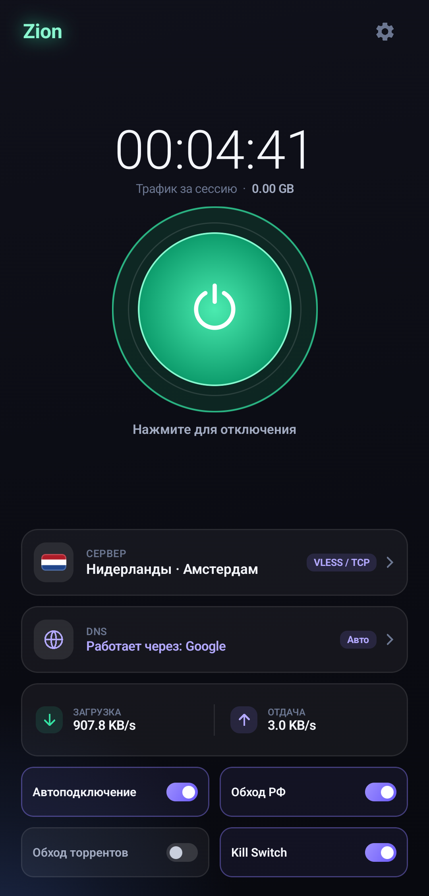
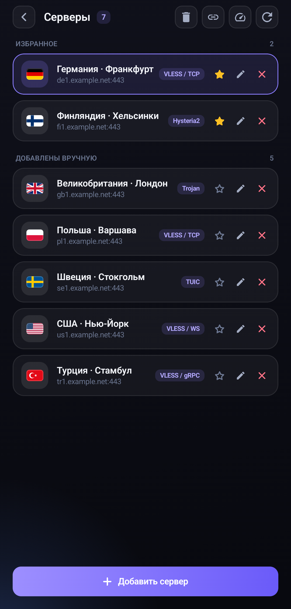
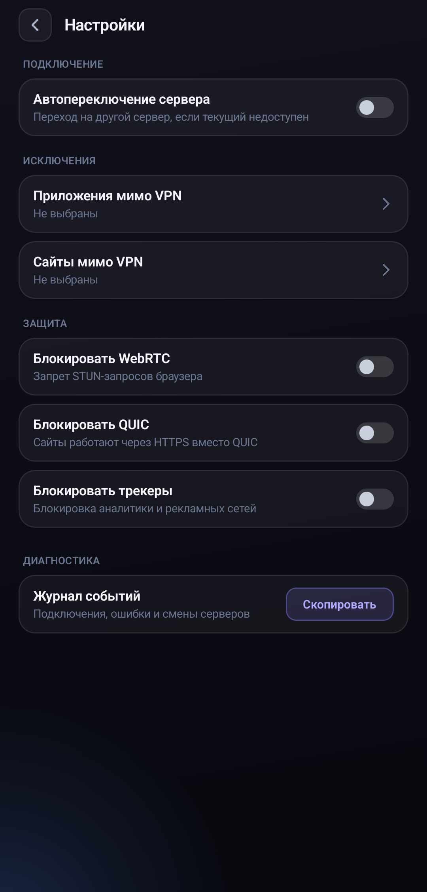

# Zion for Android

VPN client for Android built on [sing-box](https://github.com/SagerNet/sing-box).

| | | |
|---|---|---|
|  |  |  |

## Features

- Protocols: VLESS (Reality, TLS), Trojan, VMess, Shadowsocks, Hysteria2, TUIC, SOCKS5, HTTP
- Subscriptions with daily auto-update and plan details
- Server check over a real connection
- System-wide tunnel (VpnService) with IPv6 leak protection
- Kill Switch
- Automatic server and DNS failover
- Split tunnelling for sites, apps, torrents and Russian domains

## Build

Requirements: JDK 17 and the Android SDK (platform 37, build-tools 37.0.0).

```
gradlew.bat assembleRelease
```

APKs land in `app/build/outputs/apk/release` (per ABI plus a universal one). Release signing is read from `%USERPROFILE%\.zion\keystore.properties`; without it the build is signed with the debug key.

The sing-box core is prebuilt in `app/libs/libbox.aar` (sing-box 1.14.2). `tools/build-libbox.ps1` rebuilds it from the official sources.

Tests: `gradlew.bat testDebugUnitTest`.
